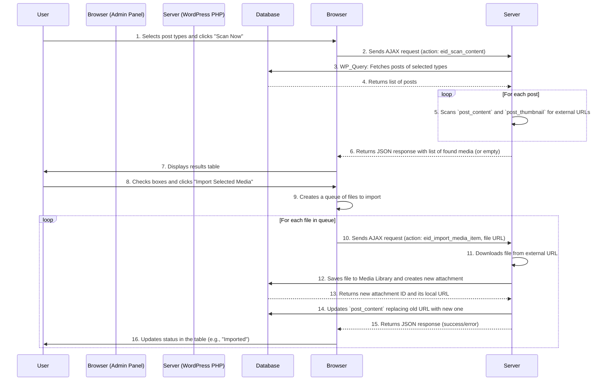

# Wordpress External Media Importer

**Authors:** Roman Rozenberger & Cline
**Version:** 1.0

A simple WordPress plugin that helps to automate the process of migrating external media to the local media library.

## Main Features

- **Content Scanning:** Scans selected post types (posts, pages, products, custom post types) for external media.
- **Filter by Extension:** Allows you to define which file types to search for (e.g., `jpg, png, webp, pdf`).
- **Media Detection:** Finds media links embedded in content (in Gutenberg blocks, classic `` and `<a>` tags) and as featured images.
- **Interactive Import:** Displays a list of found media and allows the user to select which ones to import.
- **Automatic Link Replacement:** After importing a file into the media library, the plugin automatically updates the post content, replacing the old, external URL with the new, local one.
- **Background Processing:** The import is handled via AJAX requests for each file individually, which prevents server timeout errors and provides real-time progress feedback.

## How to Use

1.  Install and activate the plugin.
2.  Navigate to the new admin menu item: **External Media**.
3.  In the **File Extensions** field, ensure all the extensions you are looking for are listed.
4.  In the **Content Types** section, check the post types you want to scan.
5.  Click **Scan Now**.
6.  After a moment, a results table will appear below. Check the boxes next to the media you want to import.
7.  Click **Import Selected Media** and watch the progress.

## Workflow Diagram

The following diagram illustrates the plugin's workflow.

## License

This plugin is licensed under the GPLv2 or later. See the [LICENSE](LICENSE) file for more details.
